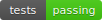
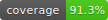
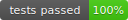
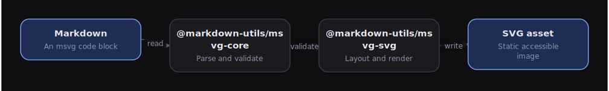
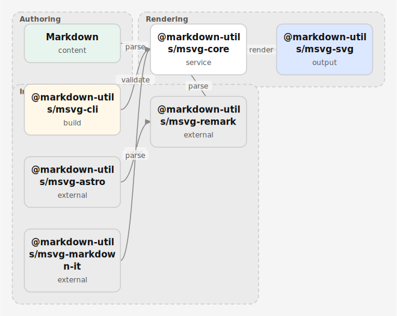
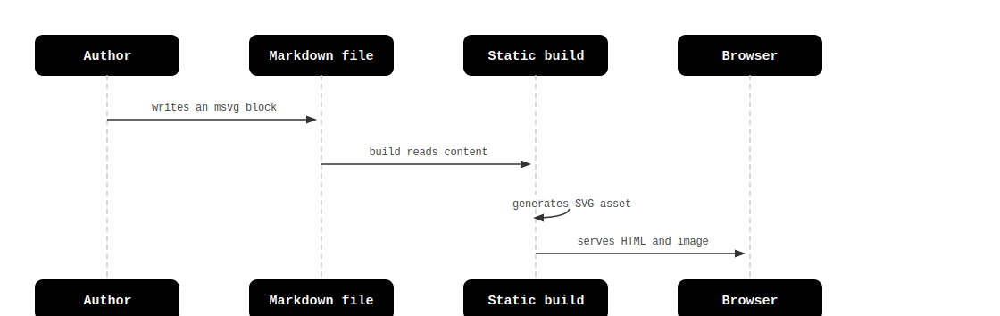
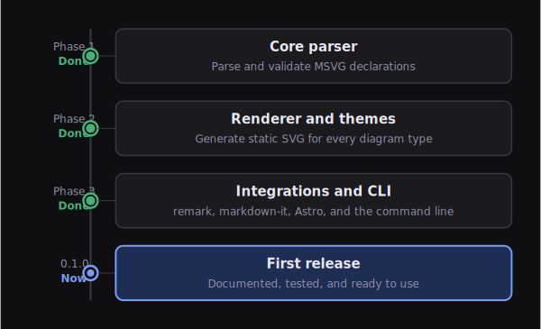

<p align="center">
  <picture>
    <source media="(prefers-color-scheme: dark)" srcset=".github/assets/logo/msvg-logo-dark.svg">
    
  </picture>
</p>

<p align="center">Turn small, readable text into static, accessible SVG diagrams.</p>

<p align="center">
  <a href="https://github.com/kristyancarvalho/msvg/actions/workflows/ci.yml"></a>
  <a href=".github/assets/badges/quality.json"></a>
  <a href=".github/assets/badges/quality.json"></a>
</p>

# MSVG

MSVG turns small, readable text descriptions into static SVG diagrams. You write a short block of YAML inside your Markdown, and MSVG produces a clean, accessible picture: a flowchart, a mind map, an architecture diagram, a timeline, and more.

It is built for technical writing: blog posts, documentation, tutorials, and developer education. You keep your diagrams in the same file as your prose, in plain text you can version with Git, and the output is a normal SVG image that works anywhere.

<p align="center">
  
</p>

> Every diagram in this README was generated by MSVG itself. See [See MSVG in action](#see-msvg-in-action) and [Regenerating the README diagrams](#regenerating-the-readme-diagrams).

## Why MSVG exists

Most diagram tools fall into one of two camps:

- Visual editors that store binary or hard-to-diff files and need a mouse.
- Diagram-as-code tools that render in the browser at runtime with JavaScript.

MSVG takes a different path:

- **Text in, SVG out.** Your source is plain YAML inside Markdown. Your output is a static `.svg` file or inline SVG. Both are easy to read, review, and version.
- **No runtime JavaScript.** Generated diagrams are plain SVG. They work in RSS feeds, static sites, and email-safe contexts. Nothing runs in the reader's browser.
- **Accessible by default.** Every diagram includes a `<title>` and, when available, a `<desc>`. Text is always escaped. Meaning never depends on color alone.
- **Deterministic.** The same input always produces the same output, so diffs stay small and snapshots stay stable.

MSVG is not a general-purpose drawing tool and does not need a browser to render. It focuses on doing editorial technical diagrams well.

## The package ecosystem

MSVG is an npm workspaces monorepo. Each package has one clear job.

| Package | What it does |
|---|---|
| `@markdown-utils/msvg-core` | Parses the MSVG YAML, normalizes it, and validates it into a typed diagram model. |
| `@markdown-utils/msvg-svg` | Lays out a diagram and renders it to a static, accessible SVG string. |
| `@markdown-utils/msvg-remark` | A remark plugin that turns `msvg` code blocks into diagrams in unified/remark pipelines. |
| `@markdown-utils/msvg-markdown-it` | A markdown-it plugin that does the same for markdown-it pipelines, ideal for RSS. |
| `@markdown-utils/msvg-astro` | An Astro integration that wires the remark plugin into an Astro site. |
| `@markdown-utils/msvg-cli` | A command-line tool to check, build, render, and inspect diagrams. |

A typical flow: you author a fenced `msvg` block, an integration (`@markdown-utils/msvg-remark`, `@markdown-utils/msvg-markdown-it`, or `@markdown-utils/msvg-astro`) detects it, `@markdown-utils/msvg-core` parses and validates it, and `@markdown-utils/msvg-svg` renders the final image.

<p align="center">
  
</p>

## See MSVG in action

These diagrams were produced by MSVG from short YAML sources, all using the `dark` built-in theme. The sources live in [`.github/assets/examples/src`](.github/assets/examples/src) and the rendered images in [`.github/assets/examples`](.github/assets/examples).

<table>
  <tr>
    <td width="50%" valign="top">
      <p><strong>Sequence</strong> &mdash; <code>dark</code> theme</p>
      
    </td>
    <td width="50%" valign="top">
      <p><strong>Timeline</strong> &mdash; <code>dark</code> theme</p>
      
    </td>
  </tr>
</table>

The hero diagram above the introduction is a `flow` diagram and the ecosystem diagram is an `architecture` diagram, both in the `dark` theme. Together with the gallery they cover four diagram types, all rendered with the `dark` theme. See [Themes](#themes) for the full list of built-in themes and [Regenerating the README diagrams](#regenerating-the-readme-diagrams) to rebuild these images.

## Installation

Pick the package that matches how you write.

For a static site built with Astro:

```bash
npm install @markdown-utils/msvg-astro
```

For a unified/remark Markdown pipeline:

```bash
npm install @markdown-utils/msvg-remark
```

For a markdown-it pipeline (for example, RSS generation):

```bash
npm install @markdown-utils/msvg-markdown-it markdown-it
```

For programmatic use in Node.js:

```bash
npm install @markdown-utils/msvg-core @markdown-utils/msvg-svg
```

For the command-line tool:

```bash
npm install @markdown-utils/msvg-cli
```

### ESM and Node.js requirements

Every MSVG package is **ESM-only**. They publish an `import` entry point and no CommonJS build, so you load them with `import` (or a dynamic `import()` from CommonJS), not `require`.

Use **Node.js 18 or newer**. MSVG is developed and tested on Node.js 22, which is the version used by the Docker workflow below.

## Quick start: write a diagram

A diagram is a fenced code block with the language `msvg`. Inside it you write YAML.

````md
```msvg
type: flow
title: "Markdown to SVG pipeline"
description: "How author text becomes a static image."
direction: LR

nodes:
  markdown:
    label: "Markdown"
    kind: input
  parser:
    label: "Parser"
    kind: process
  renderer:
    label: "SVG renderer"
    kind: process
  svg:
    label: "SVG asset"
    kind: output

edges:
  - markdown -> parser: "read"
  - parser -> renderer: "layout"
  - renderer -> svg: "write"
```
````

Every diagram needs a `type` and a `title`. The `description` is optional but recommended, because it becomes the SVG's accessible description.

## Quick start: programmatic use

If you just want an SVG string from a diagram description, use `@markdown-utils/msvg-core` and `@markdown-utils/msvg-svg` together.

```ts
import { parseAndValidate } from "@markdown-utils/msvg-core";
import { renderSvg } from "@markdown-utils/msvg-svg";

const source = `
type: flow
title: "Build pipeline"
direction: LR
nodes:
  a:
    label: "Source"
    kind: input
  b:
    label: "Build"
    kind: process
  c:
    label: "Output"
    kind: output
edges:
  - a -> b: "compile"
  - b -> c: "emit"
`;

const result = parseAndValidate(source);

if (result.valid && result.diagram) {
  const { svg } = renderSvg(result.diagram);
  console.log(svg);
} else {
  for (const diagnostic of result.diagnostics) {
    console.error(`${diagnostic.severity}: ${diagnostic.message}`);
  }
}
```

`parseAndValidate` always returns diagnostics. When `valid` is `true`, `diagram` is a fully typed, normalized model ready to render.

## Using MSVG with Astro

Add the integration to your Astro config. It registers the remark plugin and writes SVG assets into your public directory.

```js
import { defineConfig } from "astro/config";
import msvgSvg from "@markdown-utils/msvg-astro";

export default defineConfig({
  integrations: [
    msvgSvg({
      outputDir: "public/msvg",
      publicPath: "/msvg",
    }),
  ],
});
```

Now any Markdown post can contain an `msvg` block. During the build, MSVG generates a static SVG file under `public/msvg` and replaces the block with a normal image reference. There is no client-side JavaScript involved.

## Using MSVG with remark

If you build your own unified/remark pipeline, add the plugin directly.

```ts
import { remark } from "remark";
import remarkHtml from "remark-html";
import { remarkMSVG } from "@markdown-utils/msvg-remark";

const file = await remark()
  .use(remarkMSVG, { output: "inline" })
  .use(remarkHtml, { sanitize: false })
  .process(markdownSource);

console.log(String(file));
```

Two output modes are available:

- `asset` (the default): writes an SVG file and inserts an image reference. Best for blogs and feeds.
- `inline`: embeds the SVG directly in the HTML. Useful when you want the SVG in the page itself.

For asset mode, pass `outputDir` and `publicPath`:

```ts
remark().use(remarkMSVG, {
  output: "asset",
  outputDir: "public/msvg",
  publicPath: "/msvg",
});
```

## Using MSVG with markdown-it

The markdown-it plugin is synchronous and a good fit for RSS generation or sanitized HTML pipelines.

```ts
import MarkdownIt from "markdown-it";
import { msvgMarkdownIt } from "@markdown-utils/msvg-markdown-it";

const md = new MarkdownIt();

msvgMarkdownIt(md, {
  output: "asset",
  outputDir: "public/msvg",
  publicPath: "/msvg",
});

const html = md.render(markdownSource);
```

In `asset` mode it emits RSS-safe image references. In `inline` mode it embeds the SVG directly.

### Asset output requirements

Asset mode writes an SVG file and then references it with an `` tag. For that reference to be valid, MSVG must actually write the file somewhere. So in `asset` mode you must provide at least one write target:

- `outputDir` — a directory MSVG writes the `.svg` file into, paired with `publicPath` for the URL prefix, or
- `emitFile` — a callback that receives the file name and SVG contents and is responsible for writing it (useful for bundlers and custom pipelines).

If neither is configured, MSVG will not emit a broken image reference. Instead it reports an `MSVG_ASSET_NO_OUTPUT` error diagnostic and falls back to inline SVG so the diagram is never lost. If you intentionally want a URL-only reference (for example, you upload the assets separately), set `urlOnly: true` to acknowledge that you are responsible for putting the file at the referenced path.

The Astro integration sets `outputDir` to `public/msvg` by default, so it always writes.

## Using the CLI

Install `@markdown-utils/msvg-cli` and run the `msvg` command.

Check that every diagram in your Markdown files is valid:

```bash
msvg check "content/**/*.md"
```

`check` understands both Markdown and standalone diagram files. Markdown files (`.md`, `.markdown`, `.mdx`) are scanned for fenced `msvg` blocks, while standalone `.msvg.yml`, `.msvg.yaml`, and `.msvg.json` files are validated as a whole. You can check a single file or a glob:

```bash
msvg check diagram.msvg.yml
```

When a path is missing, a glob matches nothing, or a directory is passed where a file is expected, `check` reports a diagnostic and exits non-zero, so broken inputs never pass silently.

Build SVG assets from your Markdown files:

```bash
msvg build "content/**/*.md" --out public/images/generated --public-path /images/generated
```

Render a standalone diagram file to a single SVG:

```bash
msvg render diagram.msvg.yml --out diagram.svg
```

Inspect the normalized diagram model and any diagnostics:

```bash
msvg inspect diagram.msvg.yml
```

Every command accepts `--json` for machine-readable output, and exits with a non-zero status when there are errors, so it fits cleanly into CI.

## Supported diagram types

MSVG supports seven diagram types. Each one has a `type` field and its own fields.

| Type | Use it for |
|---|---|
| `flow` | Processes, pipelines, decision flows, directed graphs. |
| `mindmap` | Concept maps and knowledge organization. |
| `layers` | Stacks, architecture layers, abstraction or security layers. |
| `comparison` | Side-by-side trade-offs and comparisons. |
| `sequence` | Interactions between actors, services, or components. |
| `timeline` | Chronological events, migrations, release paths. |
| `architecture` | System topology with components, groups, and connections. |

### flow

```msvg
type: flow
title: "Request handling"
direction: LR
nodes:
  client:
    label: "Client"
    kind: input
  api:
    label: "API"
    kind: process
  db:
    label: "Database"
    kind: output
edges:
  - client -> api: "request"
  - api -> db: "query"
```

Node kinds: `default`, `input`, `process`, `decision`, `output`, `warning`, `success`. Directions: `LR`, `RL`, `TB`, `BT`.

### mindmap

```msvg
type: mindmap
title: "MSVG"
root: "MSVG"
branches:
  Authoring:
    - "Markdown"
    - "YAML"
  Rendering:
    - "Static SVG"
    - "Themes"
```

### layers

```msvg
type: layers
title: "Rendering architecture"
direction: top-down
layers:
  - label: "Markdown"
    note: "Author-written source"
  - label: "Layout"
    note: "Measured positions"
  - label: "SVG"
    note: "Static output"
```

### comparison

```msvg
type: comparison
title: "Inline SVG vs asset SVG"
columns:
  inline:
    label: "Inline SVG"
    tone: neutral
    items:
      - "Embedded in HTML"
      - "Easy to style locally"
  asset:
    label: "Asset SVG"
    tone: positive
    items:
      - "Works as a normal image"
      - "Cacheable and RSS-friendly"
verdict: "Prefer asset output for blogs and feeds."
```

### sequence

```msvg
type: sequence
title: "Post rendering"
participants:
  author: "Author"
  build: "Build"
  browser: "Browser"
messages:
  - author -> build: "writes msvg block"
  - build -> browser: "serves HTML and image"
```

### timeline

```msvg
type: timeline
title: "Release path"
events:
  - at: "Phase 1"
    title: "Core parser"
    status: done
  - at: "Phase 2"
    title: "Renderers"
    status: current
  - at: "Phase 3"
    title: "Integrations"
    status: future
```

### architecture

```msvg
type: architecture
title: "Package architecture"
direction: LR
groups:
  rendering:
    label: "Rendering"
    components:
      - core
      - svg
components:
  core:
    label: "Core"
    kind: service
  svg:
    label: "SVG renderer"
    kind: output
connections:
  - core -> svg: "render"
```

## The MSVG language

The source language is YAML inside a fenced `msvg` block, or a standalone `.msvg.yml`, `.msvg.yaml`, or `.msvg.json` file used through the CLI.

Common top-level fields:

| Field | Required | Description |
|---|---|---|
| `type` | Yes | One of the supported diagram types. |
| `title` | Yes | A human-readable title. Becomes the SVG `<title>`. |
| `description` | No | An accessible description. Becomes the SVG `<desc>`. |
| `alt` | No | Explicit alternative text for asset-mode images. Takes priority over `description`. |
| `caption` | No | A visible caption when the target supports it. Rendered as a `<figcaption>` in asset mode. |
| `theme` | No | A built-in theme name or custom theme tokens. |
| `direction` | Depends | Layout direction for types that support it. |
| `id` | No | A stable diagram id; otherwise one is generated. |

Edges and connections support two equivalent forms:

```yaml
edges:
  - a -> b: "label"
  - from: b
    to: c
    label: "next"
```

Both normalize to the same internal structure.

## Themes

MSVG ships four built-in themes: `paper` (the default), `neutral`, `mono`, and `dark`. Set one with the `theme` field:

```msvg
type: flow
title: "Dark themed flow"
theme: dark
direction: LR
nodes:
  a:
    label: "Start"
  b:
    label: "End"
edges:
  - a -> b: "go"
```

### Custom themes

`theme` can also be an object that customizes a built-in theme. A custom theme can `extend` a built-in, pick a light or dark base with `mode`, and override individual color tokens. Every token is validated, so a theme can never inject unsafe content: only hex colors, `rgb()`/`rgba()`, a small allowlist of safe named colors, and `transparent` are accepted. Anything else (a raw `url(...)`, `javascript:`, a stray `style` string) is rejected with a diagnostic and the safe base value is kept.

```msvg
type: flow
title: "Brand themed flow"
theme:
  extends: paper
  mode: light
  tokens:
    color:
      accent: "#6d28d9"
      canvas: "#fbfaff"
direction: LR
nodes:
  a: { label: "Start" }
  b: { label: "End" }
edges:
  - a -> b: "go"
```

### Output modes

By default MSVG resolves a theme to concrete colors and writes them straight into the SVG. This is the most portable mode: it works in RSS feeds, email-safe contexts, and anywhere CSS is stripped. Integrations and the rendering API can also request other output modes through `themeOutputMode`:

| Mode | What it produces | When to use it |
|---|---|---|
| `static` (default) | Concrete resolved colors, no CSS or scripts. | RSS, email, maximum portability. |
| `css-variables` | A scoped `<style>` block defining `--msvg-*` variables, with each color emitted as `var(--msvg-token, fallback)`. | Sites that want to re-theme diagrams with CSS. |
| `media-query` | The same variables plus a `@media (prefers-color-scheme: dark)` block built from the `dark` theme. | Diagrams that should follow the reader's system light/dark setting. |

Every CSS variable always carries a concrete fallback, so the diagram still renders correctly when the variables are not overridden. You can also pass `themeMode: "light" | "dark" | "auto"` to choose the base color mode, and `background: "auto" | "solid" | "transparent"` to control the diagram background.

When you use an integration, these are plain options:

```ts
remark().use(remarkMSVG, {
  output: "inline",
  theme: "dark",
  themeOutputMode: "css-variables",
});
```

## Accessibility guarantees

MSVG is designed so generated diagrams are usable by everyone:

- Every SVG includes a `<title>` from your diagram `title`, a `<desc>` when available, and a `role="img"` with `aria-labelledby` wiring the two together.
- The `<title>`, `<desc>`, and marker ids are unique per diagram, so two diagrams with the same title on one page never collide. Integrations salt the ids automatically.
- A `<desc>` is included when you provide a `description` or one can be generated from the diagram.
- All user-provided text is escaped before it enters the SVG.
- Meaning is carried by shape, label, spacing, and grouping, not color alone. Timeline statuses (`Done`, `At risk`, `Blocked`, and so on) and comparison tones (`Pros`, `Cons`, `Caution`, `Neutral`) render as text labels, not just colored fills.
- A visible `caption` is rendered as a `<figcaption>` in asset mode, and asset images use `loading="lazy"` and `decoding="async"`.

### Asset alt text

In asset mode the generated `` always has descriptive `alt` text. MSVG picks the first available value in this order:

1. an explicit `alt` field on the diagram,
2. the diagram `description`,
3. a generated description derived from the diagram contents,
4. the diagram `title`.

So setting `alt` or `description` on a diagram gives you full control over the alternative text without changing the visual output.

## Security guarantees

MSVG treats every diagram as untrusted input:

- All text is escaped before being written to SVG or HTML.
- Raw HTML in labels, notes, captions, and edge labels is never trusted.
- Generated SVG never contains `<script>`, event handlers, remote URLs, remote fonts, or external images.
- Arbitrary `style` strings are not allowed; only validated theme tokens are used.
- File output is restricted to the configured output directory, and output paths cannot escape it.
- Invalid input fails safely with clear diagnostics instead of producing broken output.

## Diagnostics

Validation and rendering produce structured diagnostics. Each one has a `code`, a `severity` of `error`, `warning`, or `info`, a `message`, and, when available, a file path, line, and helpful hint.

Errors stop a diagram from rendering. Warnings let it render but flag issues such as labels that may overflow or diagrams that are getting dense. The CLI prints them in a readable format by default and as JSON with `--json`.

## Examples

The repository ships runnable examples in the `examples/` workspace:

- `examples/basic-node` shows programmatic use with `@markdown-utils/msvg-core` and `@markdown-utils/msvg-svg`.
- `examples/markdown-it-rss` shows markdown-it usage for RSS-style output.
- `examples/astro-blog` shows the Astro integration with a Markdown post.

These examples double as manual and automated validation of the packages.

## Development with Docker

All project development runs inside Docker. You do not need Node.js, npm, or any project tool installed on your host machine. The host is only used for `git`, `gh`, `docker`, `docker compose`, and editing files.

The Docker Compose service is named `msvg`.

Build the development image:

```bash
docker compose build
```

Install dependencies inside the container:

```bash
docker compose run --rm msvg npm install
```

Type-check every package:

```bash
docker compose run --rm msvg npm run check
```

Run the tests:

```bash
docker compose run --rm msvg npm run test
```

Build every package:

```bash
docker compose run --rm msvg npm run build
```

Run the full verification gate (checks, tests, coverage, snapshots, integration, end-to-end, and build):

```bash
docker compose run --rm msvg npm run verify
```

Do not run `npm`, `node`, `npx`, `tsc`, `vitest`, or `astro` directly on your host. Always go through the `msvg` Docker service.

## Regenerating the README diagrams

The diagrams shown in this README are not hand-drawn. They are generated from small YAML sources in [`.github/assets/examples/src`](.github/assets/examples/src) using MSVG's own packages, and written to [`.github/assets/examples`](.github/assets/examples).

To regenerate them after editing a source, build the packages and run the generator inside Docker:

```bash
docker compose run --rm msvg npm run build
docker compose run --rm msvg npm run assets:generate
```

The generator reads every `*.msvg.yml` file in the source directory, validates it with `@markdown-utils/msvg-core`, renders it with `@markdown-utils/msvg-svg`, and writes a matching `.svg` next to the others. Each source picks its own theme through the `theme` field, so the gallery stays in sync with the library.

## Continuous integration and quality

Every push and pull request runs the GitHub Actions workflow in [`.github/workflows/ci.yml`](.github/workflows/ci.yml). It builds the same Docker image you use locally and runs the full verification gate inside it, so CI and local development behave the same way.

The workflow also produces the quality widgets shown at the top of this README. Coverage and test counts are read straight from the test run, with no third-party badge service:

```bash
docker compose run --rm msvg npm run quality:report
```

This runs every package's tests with coverage, then [`scripts/quality-report.mjs`](scripts/quality-report.mjs) aggregates the results and writes self-contained SVG badges and a machine-readable summary into [`.github/assets/badges`](.github/assets/badges):

- `tests.svg` shows whether the suite is passing.
- `coverage.svg` shows the overall line coverage percentage.
- `tests-passed.svg` shows the percentage of tests that passed.
- `quality.json` holds the same numbers, including a per-package breakdown.

On pushes to `dev`, the workflow refreshes these badge files automatically so the README always reflects the latest run.

### The one Docker exception: publishing

All development and CI verification run inside the `msvg` Docker service. The single documented exception is the npm publish workflow in [`.github/workflows/publish.yml`](.github/workflows/publish.yml), which runs on the GitHub Actions host rather than in Docker. This is required because npm trusted publishing uses OIDC (`id-token: write`), which is only available to the host runner. The publish job still runs the same `verify` gate before publishing, so the release is held to the same standard.

## Development documentation

MSVG keeps documentation in two places, and it helps to know which is which:

- **Public documentation** lives in this README and in each package's README. It is written for people who use MSVG, and it is published to npm and GitHub.
- **Internal development notes** live in the `/specs` directory: architecture drafts, implementation plans, and local planning material. The `/specs` directory is intentionally ignored by Git and is never published.

Contributors should not commit anything under `/specs`. Anything meant for users belongs in a README instead. See [CONTRIBUTING.md](CONTRIBUTING.md) for the full documentation workflow.

## Versioning

MSVG uses synchronized versions across all packages. The MSVG language is part of the public API, so a breaking change to the syntax is treated as a major version change. New diagram types, new options, and new themes are minor changes. Bug fixes that do not change behavior are patch changes.

## License

See the [LICENSE](LICENSE) file.
